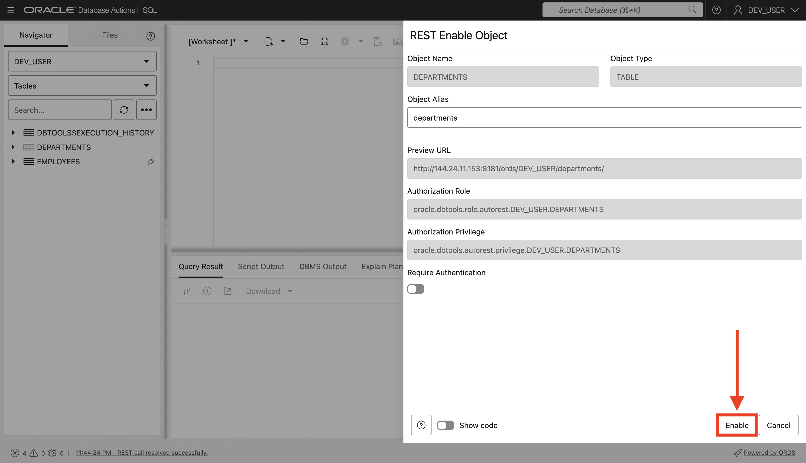
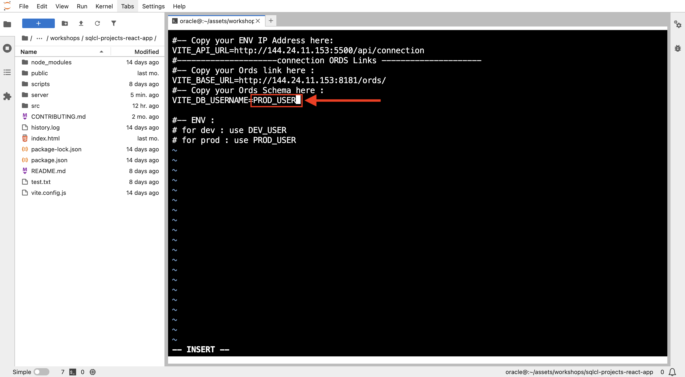

# Application development & deployment

## Introduction

Now that your application is up and running, this lab will guide you through developing a new feature. You will enable the department feature by making necessary changes to both the application and the database, ensuring full functionality.

**Estimated Lab Time:** 14 minutes

### **Objectives**

* Identify and apply the required changes in the application code.
* Create the department table in the DEV_USER schema (development environment).
* Switch to the production environment and explore the database challenge.

### **Prerequisites**

* HR application up and running.
* Basic knowledge of SQL and coding.
* Completion of the previous lab.

## Task 1: Understanding Environments and Database CICD Challenges

### **Environments Overview**

Database CI/CD ensures synchronization between two databases, allowing us to deploy changes from a source database to a target database and keep them in sync.


In this lab, we will work with these two environments:

* **Development (Dev):**
    * Where you create and fix database changes.
* **Production (Prod):**
    * Where you deploy stable and reliable database updates.
    * *Our goal in the current and next labs is to successfully deploy the “Departments” and “Analytics” features to the Prod environment.*

    

>**Note:** There are often other environments involved in the development lifecycle (Test, pre-prod, ...) but this workshop just those two ones above that we need.


### **Challenges of Traditional Database Deployments**
In traditional database deployments, especially in a manual process, several challenges arise:

* **Manual Interventions:** Prone to errors and time-consuming.
* **No Automation:** Slows down deployments and adds inconsistencies.
* **High Error Risks:** Bugs and data issues can disrupt production.

**Our Goal:**


Use SQLcl's **project** command to:

* Create your local database application work environments
* Track changes and create database install and upgrade scripts
* Automate and ensure consistent deployments.

<!--* Deploy with minimal risk.
* Automate and ensure consistent deployments.
* Speed up feature delivery.
* Gain practical experience for real-world database projects.-->

## Task 2: Unlock Departments Page

Find the placeholder component within the application's code, and replace it with Department implementation.

1. Go to : `/sqlcl-projects-react-app/src/componenets/pages/HRPageContentSwitcher.tsx`

2. Find departments change location in the code (line 65)

3. Remove what's after "return" (line 67) and replace it with the just the below commented line
4. Implement Department by adding `<DepartmentPage />` and delete the placeholder component

5. Now, refresh the application window and head to the departments section—your new feature is live!

    >**Note:** *if it doesn't appear just wait a little bit and refresh again until it appears*


But the table is empty, with no rows, and all the statistics show 0. Let's fix that in the next task!

## Task 3: Database change (Create Departments Table)

The issue in the previous task occurred because the departments table is missing. This will be resolved by creating it in the DEV_USER schema.

* Database Changes: Create the "Departments" Table

    <details><summary>**Option 1: Using SQLcl**</summary>
    * Go to the application folder in the left side and double click on the **scripts** folder
    
    * Double click on departments_table.sql to see the table ddl and data to insert
    
    * Execute the previous sql file in SQLcl starting by the ddl then the inserts

        >**Note:** Make sure you are in the scripts directory before executing the sql file in SQLcl.

        ```
        <copy>
            cd /home/oracle/assets/workshops/sqlcl-projects-react-app/scripts/
        </copy>
        ```
        ```
        <copy>
            @departments_table.sql
        </copy>
        ```
        
    </details>

        <details><summary>**Option 2: Using Database Actions**</summary>
        * Go to Database Actions
        * Connect as DEV_USER
        * Copy all the content of `departments-table.sql` file, then past it in the worksheet there and click on the run script button
        
        </details>

## Task 4: Enable ORDS Endpoint For Departments Table

1. Open Oracle Database Actions
2. Connect as DEV_USER
3. Select **Tables**, right-click on **`DEPARTMENTS`**, choose **REST**, and then click **Enable**

4. Click **Enable** at the bottom right

5. The **DEPARTMENTS** table is **REST enabled** now


## Task 5: Check the Departments Page After Database Update

* Go to the application, refresh the page, and head to the departments section—you'll see the data appearing now!


## Task 6: Deploy the application to production

Now, our application is ready for the next release (version 2), and will be deployed to production.

>**Note:** We will just simulate and imagine this process of deployments due to time constant of the workshop and also to avoid diverging from the workshop main goal (Explore Project command in SQLcl)

When moving to production, we will no longer be working with the development database (DEV\_USER). Instead, the application will use the **production database**, which, in this workshop, is represented by the **PROD\_USER** schema.

Let's assume our production database is PROD_USER for all the next operations.

All right, so now we will go to the .env file and replace **DEV\_USER** with **PROD\_USER**

1. In the terminal, make sure ypu are in the application directory.

2. Edit the `.env` file with:
            ```
        <copy>
            vi .env
        </copy>
        ```

3. Press Esc + I to enter insert mode.

4. Replace **DEV\_USER** with **PROD\_USER**. Use the Up, Down, Left, and Right arrow keys to navigate to your target.

    

5. Press **Esc**, then type **:wq** and press **Enter** to save and exit.

6. Go to the application and refresh

7. Click on the Departments section


There are no rows at the moment, which is expected because we switched from DEV\_USER (development environment) to PROD\_USER (production environment), where the departments table doesn’t exist yet. You can verify this by connecting to the PROD_USER schema and checking its tables.


**What would be the next ?**

In a traditional approach, we would manually apply changes to the production database, increasing the risk of errors and inconsistencies. But with **SQLcl's project command**, we can automate database changes and bring the power of **CI/CD** to database management!


Ready to fix this issue and explore **SQLcl Project feature** and get the databases synched? Let's jump into the [next lab](#next) and get it done!

<!--Let's fix this issue and dive into SQLcl Projects in the next lab!-->

## Learn More

* Click [here](https://docs.oracle.com/en/database/oracle/sql-developer-command-line/24.3/sqcug/introduction.html?utm_source=pocket_shared) for documentation on using SQLcl Projects.

* [Oracle Cloud Doc](https://www.oracle.com/cloud/)

## Acknowledgements

* **Author** - Fatima AOURGA & Abdelilah AIT HAMMOU, Junior Members of The Technical Staff, SQLcl
* **Created By/Date** - Fatima AOURGA, Junior Member of Technical Staff, SQLcl, February 2025