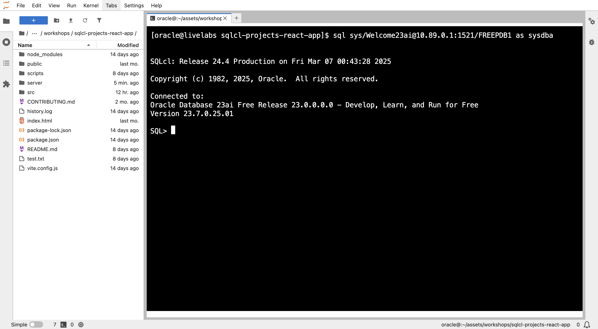
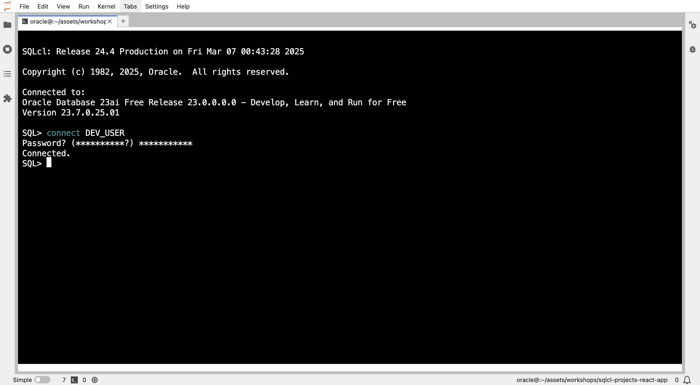
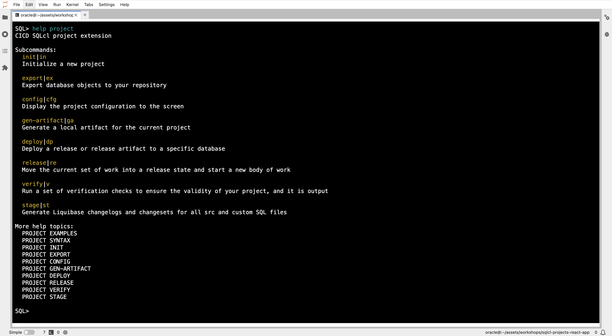
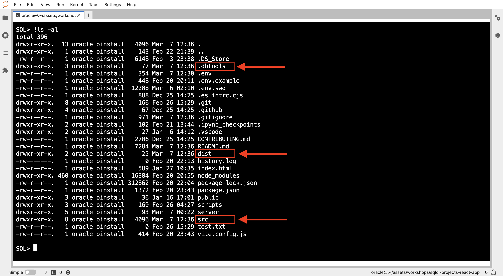
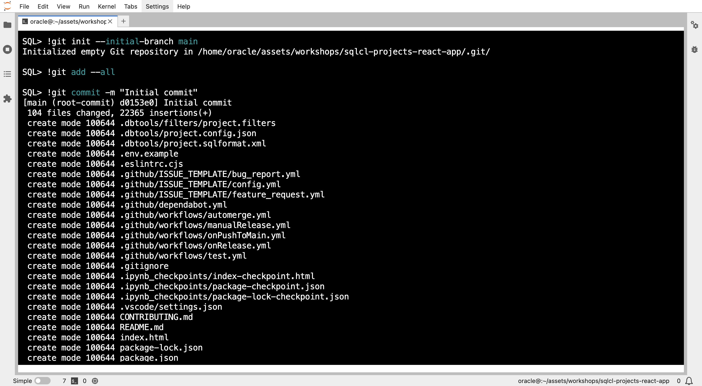
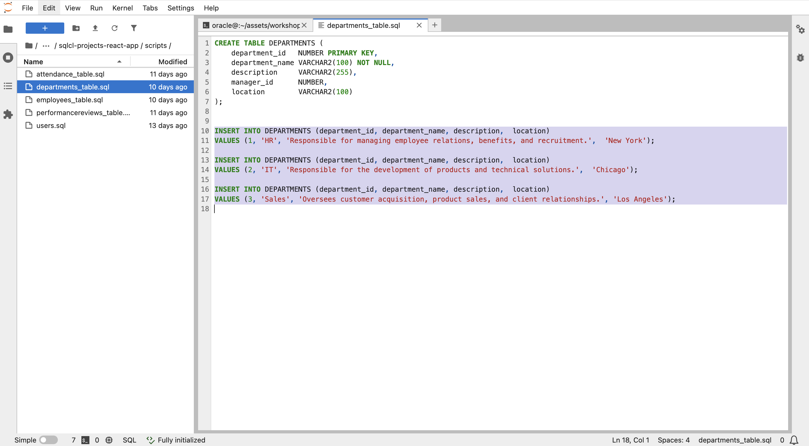
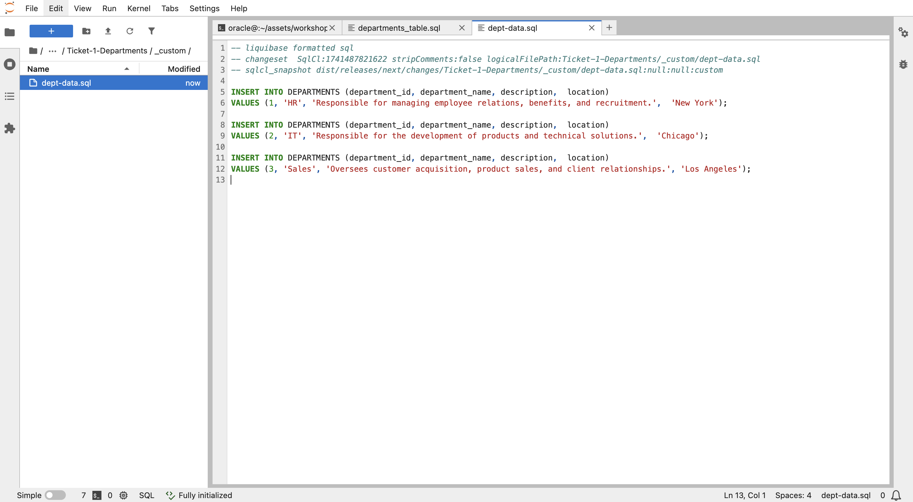
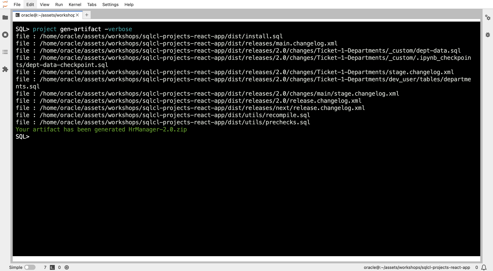

# CI/CD for Database Deployments

## Introduction

Welcome aboard! You're about to embark on an exciting project: developing the "Departments" feature for the growing HR application.

The SQLcl Project feature contains many commands: we will explore them all in this lab.

### **The Challenge**

The Tech Company Solutions is a thriving company experiencing rapid growth. Their current HR systems, while sufficient in the past, are now struggling to keep up with the increasing number of employees and departments. To address this, they need a Department Management system to improve efficiency and organization.


### **Your Mission**

Before we dive into the code, let's explore the existing HR application. In this lab, you'll:

* **Understand the Current System:** Understand existing functionalities and where the "Departments" feature fits.
* **Learn SQLcl and CI/CD:** Use SQLcl's project feature for the development and deployment process.

### **Focus on the Process**

Remember, the primary goal of this lab is to learn the principles of database development and deployment using SQLcl and CI/CD practices. The specific technology used in the application itself is not the main focus.

**Estimated Lab Time:** 14 minutes

### **Objectives**

By the end of this lab, you will be able to:

* Add the new feature to the application with database and code changes.
* Use SQLcl to manage and deploy database changes.
* Practice and apply SQLcl project commands through hands-on exploration.
* Experience and understand the benefits of database CICD

### **Prerequisites**

* Completion of previous labs
* Basic understanding of Git

## Task 1: Initialize Project (project init)

* **Connecting to DEV_USER via SQLcl:**
    1. Launch SQLcl in the jupyter terminal
            ```sql
      <copy>
        sql SYS/[PASSWORD]@[IP_ADD:PORT]/FREEPDB1 as sysdba
      </copy>
      ```
      
      >**Tip:** Click the icon in the screenshot below to enter full-screen mode.

      

    2. Connect to the DEV_USER schema using connect command
            ```sql
      <copy>
        connect DEV_USER/[PASSWORD]
      </copy>
      ```
      

    >**Tip:** You can clear your screen anytime you want by using **clear screen** command or just its short format **cle scr**:
        ```sql
        <copy>
            cle scr
        </copy>
        ```

* **Project Initialization:**

    * Make sure you are it the application folder before running **project** commands

        

    >**Tip:** Press Tab to view completions, then keep pressing Tab or use the arrow keys to navigate. Press Enter when you find the desired option.
      

    * Initializing project
    ```sql
      <copy>
        project init -name HrManager -schemas DEV_USER -verbose
      </copy>
      ```

      

      The `project init` command initializes a new project, setting up the necessary directories and files for managing your database objects and changes within your current directory.

      >**Note:** Use `help project` for more info
        ```sql
        <copy>
            help project
        </copy>
        ```
        

    * **Project Structure:**
        * SQLcl Project feature use a specific folder structure to manage database objects and changes.
        * Key folders include:
            * **`.dbtools`:** This folder contains project configuration files, filters, and formatting rules. It's a hidden folder.
            * **`src`:** This folder stores exported objects from the database, organized by schema and object type.
            * **`dist`:** This folder contains the distributable for each release

            ```text
            ──.dbtools
            │   ├── filters
            │   │   └── project.filters
            │   ├── project.config.json
            │   └── project.sqlformat.xml
            ├── dist
            │   └── install.sql
            └── src
                └── database
            ```
        * List all, to see the generated project folders
        

    <!--<details>  <summary> **Screenshots:**</summary>
    
    </details>-->

    * Initialize git
            ```sql
        <copy>
        !git init --initial-branch main
        </copy>
        ```
    >**Note:** We use a bang or exclamation mark (**!**) at the beginning of hosted commands (non-SQLcl commands) to run them within SQLcl.
    <!--In SQLcl, it is used as a shell escape to run external (non-SQLcl) commands.-->

    * Add and commit
        ```sql
        <copy>
            !git add --all
        </copy>
        ```
        ```sql
        <copy>
            !git commit -m "Initial commit"
        </copy>
        ```
        

    * Create a new git branch and switch to it for this feature:
        ```sql
        <copy>
            !git checkout -b Ticket-1-Departments
        </copy>
        ```
        ```sql
        <copy>
            !git branch
        </copy>
        ```
        ```sql
        <copy>
            !git status
        </copy>
        ```
    

    >**Note:** You can choose the name you want for your branch. It doesn’t have to match this one.

    This creates a new branch named "Ticket-1-Departments" where you will develop and test the "Departments" feature as a ticket assigned to you within a sprint.

## Task 2: Set Configuration (project config)

Since the source and target databases use different schemas, we need to set emitSchema to false in project.config.json (inside .dbtools). By default, this setting is true, meaning exported DDL includes fully qualified object names in the format schema.object (e.g., dev_user.departments). Disabling it ensures objects are created without schema prefixes in the target database.

<!--Since the source and target databases have different schemas, we need to set emitSchema (a setting in the project.config.json file under the .dbtools folder) to false. This setting determines whether the object name will be prefixed with its schema (fully qualified).-->

```sql
<copy>
    project config -list -name export.setTransform.emitSchema
</copy>
```
```sql
<copy>
    project config set -name export.setTransform.emitSchema -value false
</copy>
```


## Task 3: Export Database Changes (project export)

For exporting, we have two options:

1. Export the entire schema, including all its objects, using the -schemas option, which accepts a list of schemas to export (in our case, just one: "DEV_USER").
2. Export specific objects using the -objects option.

Since we only need the departments table from "DEV_USER", we will use the -objects option.

>**Note:** Use `help project export` for more details on the export command.
    ```sql
    <copy>
     help project export
    </copy>
    ```

**Export Database Objects:**

To see what's happen when exporting the whole schema drop down **Export schema** just below. But for this task you will not export the whole schema, you will export just the departments object.
    <details><summary>**Export schema**</summary>
        * Execute the following command to export the newly created "Departments" table to the application folder:
            ```sql
        <copy>
        project export -schemas DEV_USER -verbose
        </copy>
            ```
        
        This command **exports database objects** into your repository.
    </details>

* Execute the following command to export the newly created "Departments" table to the application folder:
            ```sql
        <copy>
            project export -objects DEPARTMENTS -verbose
        </copy>
            ```
        
        This command **exports database objects** into your repository.

>**Note:** In the export command the object is not fully qualified (DEV_USER.DEPARTMENTS) since you are currently connected to its schema (DEPARTMENTS).

* Locate the exported object files in the database folder

    

* Double click on the 'departments.sql' to see its content

    

* **Now we have made the database changes, we export our objects to have them included in our project folders.**

## Task 4: Stage Changes (project stage)

* **Stage Changes:**

    * Add and commit changes before stage
            ```sql
        <copy>
            !git status
        </copy>
            ```
            ```sql
        <copy>
            !git add --all
        </copy>
            ```
            ```sql
        <copy>
            !git status
        </copy>
            ```
        ```sql
        <copy>
            !git commit -m "Add departments table"
        </copy>
            ```
        

    * Execute the following command to stage the changes for release
            ```sql
        <copy>
            project stage -verbose
        </copy>
            ```
    

    This command prepares the staged changes for release by creating a release artifact in the `dist` folder.

* **Add custom scripts**

    You can add custom scripts using the **add-custom** sub-command of the stage command

    * Add the custom file to the stage
                ```sql
            <copy>
                project stage add-custom -file-name dept-data.sql -verbose
            </copy>
                ```
        

        A custom folder will be added to the dist folder containing the created custom sql file

    * Navigate to the scripts folder

        
    
    * Copy the insert statements from `departments_table.sql`

        

    * Locate the newly created dept_data.sql file

        The file can be found at:`sqlcl-projects-react-app/dist/releases/next/changes/Ticket-1-Departments/_custom`

        

    * Open the dept_data.sql file and paste the insert statements

        Double-click the file and paste the copied inserts inside.

        

        <!--TODO: add commit-->

* **Merge to main branch:**
        ```sql
    <copy>
        !git checkout main
    </copy>
        ```
        ```sql
    <copy>
        !git merge Ticket-1-Departments
    </copy>
        ```
    <!---->

* **Resolve any merge conflicts:** (If necessary)

## Task 5: Release Changes (project release)

* Once your changes are merged into the main branch, execute the following command to create a release:
        ```sql
    <copy>
        project release -version 2.0 -verbose
    </copy>
        ```
    

* This command creates a release folder with the specified version.

## Task 6: Generate Deployable Artifact (project gen-artifact)

* The `project gen-artifact` command can be used to generate an artifact for your database changes. This artifact can then be easily deployed to different environments.
        ```sql
    <copy>
        project gen-artifact -verbose
    </copy>
        ```
    

* If you return to the application folder, you will fid an new folder **artifact** created, and it contains our generated zip artifact.

    

In the next section, we will learn how to deploy these changes to the production environment using SQLcl and explore advanced CICD concepts.

## Task 7: Deploying to Production (project deploy)

* **Connect to the Production Database:**
    * Establish a connection to the production database using SQLcl.
    * Use the `connect` command with the `PROD_USER` credentials.

        ```sql
    <copy>
        connect PROD_USER/[PASSWORD]
    </copy>
        ```
    

* **Deploy Changes to Production:**

    * Execute the following command to deploy the changes to the production database:
        ```sql
    <copy>
        project deploy -file HrManager-2.O.zip  -verbose
    </copy>
    ```
        

    * This command applies the changes defined in the release artifact to the production database without recreating existing schema objects.

    * If you check now you find the departments table in the PROD_USER. But what are the other tables ?

        

* **SQLcl Liquibase**

    The other three tables created are Liquibase tables. Liquibase is the engine behind the SQLcl Project feature, executing the `liquibase update` command behind the scenes. It checks for differences between the source and target databases—if differences exist, it applies the necessary changes to synchronize them; if not, no action is taken.

    <!--The other three created tables are liquibase tables. Liquibase is the engine of the SQLcl Projects tool that apply its command 'liquibase update' behiend scens to check if there is any differences between the source and target database, if they are it apply the changes to get them synched, if they are not, it does't do anything. So it checks that there are diffs before doing anything.-->

    

* **Enable REST Endpoints**

    To expose the Departments table in PROD\_USER as a REST endpoint, follow the same steps you performed for DEV\_USER in **Lab 1 → Task 4**.

    1. Open Database Actions
    2. Connect as PROD_USER
    3. Locate the Departments table, right-click on it.
    4. Select REST, then click Enable.

    </br>

* **Run the Production Application:**

    1. Restart the application using the production environment variables.
    2. Verify that the "Departments" feature is functioning correctly in the production environment.
    3. Perform thorough testing to ensure that all aspects of the feature are working as expected.

    </br>

* **The department section, should locks like this:**

    

**You did it!** You have successfully implemented and deployed the "Departments" feature and release the version 2 of the application using SQLcl and CICD practices. You have gained valuable experience in managing database changes, automating deployments, and working with a CICD pipeline.

## Learn More

Click [here](https://docs.oracle.com/en/database/oracle/sql-developer-command-line/24.3/sqcug/introduction.html?utm_source=pocket_shared) for documentation on using Project command in SQLcl.

## Acknowledgements

* **Author** - Fatima AOURGA & Abdelilah AIT HAMMOU, Junior Members of The Technical Staff, SQLcl
* **Created By/Date** - Fatima AOURGA, Junior Member of Technical Staff, SQLcl, February 2025
