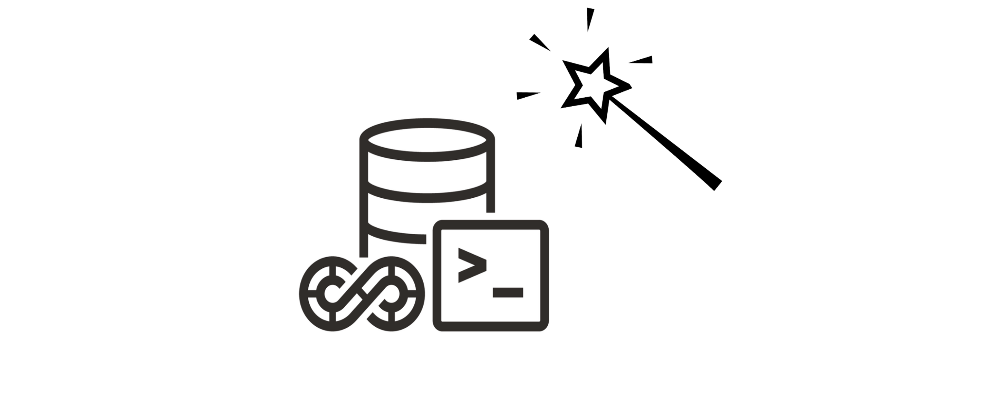

# Introduction

## About this Workshop

As a developer at Tech Solutions Company, you’ve been tasked with adding new features to the HR application. As the company grows, so do the challenges of managing both the application and its database.

Many developers appreciate the benefits of CI/CD pipelines for automating application deployments, yet database CI/CD integration is often overlooked. Manually handling database updates, rollbacks, and migrations can lead to significant errors and delays. What if managing database changes could be as seamless as deploying application code?

Meet the **SQLcl Projects CI/CD workflow** a powerful tool designed to revolutionize database development. Oracle SQLcl brings automation, consistency, and reliability to database management, empowering developers like you to handle changes efficiently and overcome common obstacles.

In this workshop, you’ll not only enhance the HR application with new features but also explore how the SQLcl Projects feature can transform your database management practices. Our goal is to demonstrate how this versatile extension—built to support more than just database applications—can elevate any project involving database management.

Estimated Workshop Time: 1 hours 30 minutes

### **Objectives**

This workshop explores the database CICD tool in SQLcl and demonstrates how to use it for you database development projects.

In this workshop, you will learn how to:

* Update an existing application and it's associated database objects
* Deploy the changes to the production database
* Address the difficulties of synching with DEV database instances
* Use SQLcl `project` command to manage you database changes

### **Prerequisites**

This workshop requires the following:

* Basic knowledge in development practices, including Git
* Experience with SQL and database schema design

**This lab has been built for the beginner**: simply follow the labs and the given steps and instructions. We provide the database, application, code, and SQLcl/Git instructions.

Upon completion of this workshop, you will understand the process of implementing CI/CD for your database applications using SQLcl.

### **Let's** [**get started!**](#next)
 

## Learn More

* [Oracle SQLcl Doc](https://docs.oracle.com/en/database/oracle/sql-developer-command-line/24.3/sqcug/working-sqlcl.html)
* [Oracle SQLcl Project & CI/CD Docs](https://docs.oracle.com/en/database/oracle/sql-developer-command-line/24.3/sqcug/database-application-ci-cd.html#GUID-6A942F42-A365-4FF2-9D05-6DC2A0740D24)
* [Oracle SQLcl Liquibase Docs](https://docs.oracle.com/en/database/oracle/sql-developer-command-line/24.3/sqcug/using-liquibase.html)
* [Video overview and demonstration for SQLcl Projects](https://youtu.be/qCc-f24HLCU?si=3z-aRBdzu_QhixJ9&t=182)

## Acknowledgements

* **Author** - Fatima AOURGA & Abdelilah AIT HAMMOU, Junior Members of The Technical Staff, Database Tooling, SQLcl developers
* **Created By/Date** - Fatima AOURGA, Junior Member of The Technical Staff, Database Tooling, SQLcl developer, February 2025